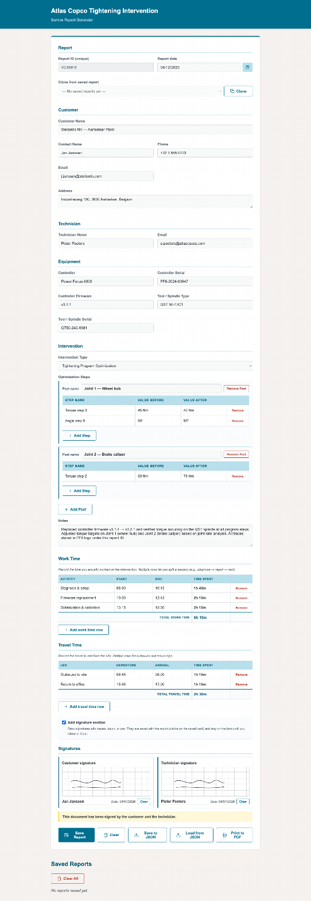
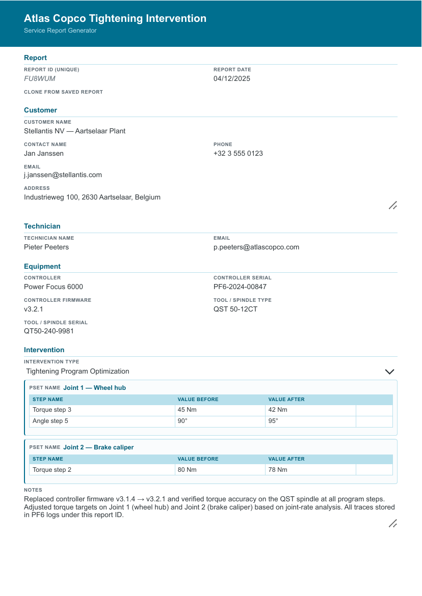
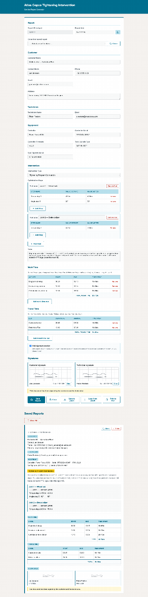

# Atlas Copco Tightening Intervention

A modern, installable web app for **Atlas Copco service technicians** to generate, sign, and print tightening intervention reports on any device — phone, tablet, or desktop. Works fully offline once installed.



> **Branded throughout** — the official Atlas Copco colour palette (`#0092BC` / RGB 0,146,188), the horizontal **AtlasCopco** wordmark in the header, and a coloured teal bar on every printed PDF page.

---

## ✨ Features

### 📋 Smart form
- **Auto-formatted dates** — DD/MM/YYYY across every device, with a built-in calendar picker
- **24-hour time inputs** — HH:MM, auto-inserted colon as you type
- **6-character unique report IDs** — base36, collision-checked against the local database
- **46 inline tooltips** — hover any label for guidance on what to fill in

### ⏱ Work & travel time tracking
- Dynamic rows with **auto-calculated durations** (handles overnight crossings)
- Live **totals** at the bottom of each table
- Pre-validated time format, no AM/PM ambiguity ever

### ✍️ Signatures
- Draw with mouse, finger, or stylus
- Names auto-fill from Contact / Technician fields
- Signatures **persist with the report** — visible on the saved card and on the printed PDF
- Date stamps **match the report date** in DD/MM/YYYY format
- Date stamps preserved on re-print

### 🖼 Images & torque graphs
- **Optional attachments block** between Notes and Work Time — toggleable when needed, hidden by default
- **Drag-and-drop** or click-to-browse for image files (PNG, JPG, GIF, SVG, WebP — up to 5 MB each)
- **Per-image caption** — printed in italics below the image on the PDF
- **Multiple images** — grid layout, each with thumbnail, caption input, file name, Remove button
- **Round-trips through JSON** — images stored as base64 data URLs so the saved-to-JSON → load-from-JSON flow preserves them exactly
- **Prints to PDF** — each image renders full-width between Notes and Work Time with its caption
- **Carries over on Clone** — unlike signatures (which are session-only), attachments are persisted data so they DO clone with the report


### 📦 Reports & data
- **Save Report** — persists to local storage with signatures + attachments + time tables + everything
- **Save to JSON** — download a portable backup with a descriptive filename (`<customer>_<date>_<id>.json`) — includes base64-encoded images
- **Load from JSON** — round-trip restore of every field including attachments
- **Clone** — copy a saved report into a fresh form (images carry over)
- **Delete** individual or all reports

### 📄 Print to PDF
- Branded **teal colour header** on the first page — matches the web page header
- **Official AtlasCopco wordmark** in the upper-right of the printed header
- **Images & Graphs section** between Notes and Work Time when attachments are enabled
- PDF file gets the **same filename pattern as JSON exports** (`<customer>_<date>_<id>.pdf`) so every saved PDF has a unique, descriptive name
- 2–3 page A4 layout: form fields + Psets/notes + work/travel/signatures + saved audit trail
- Compact print styles, hides buttons and decorative chrome




### 📱 Installable PWA
- Add to Home Screen on Android / iOS
- Install as standalone app on desktop Chrome/Edge
- **Service worker pre-caches the app shell** — full offline use after first load
- Branded teal theme with the new AtlasCopco wordmark, 192/512/maskable icons

### 📱 Mobile-friendly
- Custom date/time inputs scale gracefully on 390 px-wide screens
- Action buttons stack vertically on mobile (full-width)
- Work Time / Travel Time tables scroll horizontally instead of being truncated
- The calendar picker is touch-friendly and stays on-screen


### 🧪 Built-in demo
- **Fill Demo** button loads a complete Stellantis NV scenario
- Safety confirm before overwriting real data
- One click to see every feature in action

---

## 🚀 Quick start

### Open it in your browser
The app is a single `index.html` with no build step:

```bash
# Option 1 — open the file directly
open index.html         # macOS
xdg-open index.html     # Linux

# Option 2 — serve it locally (recommended for PWA + service worker)
python3 -m http.server 8765
# then visit http://localhost:8765
```

### Install as an app
- **Android Chrome / Edge** → menu → *Install app*
- **iOS Safari** → Share → *Add to Home Screen*
- **Desktop Chrome / Edge** → install icon in the address bar

Once installed it opens full-screen, runs offline, and behaves like a native app.

---

## 📖 How to use

1. **Fill the report** — type or paste your data. Every label has a tooltip explaining what to enter.
2. **Sign** — toggle the signature section, draw on both pads with your finger, mouse, or stylus.
3. **Track time** — add rows for each work block and travel trip (e.g. outbound to site, return to office). Durations and totals are calculated automatically.
4. **Attach images** *(optional)* — toggle the *Add images / torque graphs* block to drop in photos, screenshots, or torque traces. Each image can carry a caption that prints under it on the PDF.
5. **Save Report** — the entry appears in the *Saved Reports* list with full details, time tables, signature thumbnails, and attachment thumbnails.
6. **Print to PDF** — open the browser print dialog and choose *Save as PDF*. The saved file gets the same descriptive name as the JSON export (e.g. `stellantis-nv-aartselaar-plant_2025-12-04_VCXMFB.pdf`) and shows the branded teal header with the AtlasCopco wordmark on the first page. Attached images appear between Notes and Work Time. Hand the file to the customer.
7. **Back up** — *Save to JSON* downloads a portable file with a descriptive name like `stellantis-nv-aartselaar-plant_2025-12-04_VCXMFB.json` (customer name sanitized, ISO date, report ID). Images are embedded as base64 data URLs so they round-trip exactly. *Load from JSON* restores it on any device.
8. **Fill Demo** — explore the app with one click (asks for confirmation before overwriting real data).

### Tips
- The form is a single page — scroll to find any section.
- After saving, the form resets its **id** and date but keeps your data so you can keep working. Click *Clear* to start truly fresh.
- Signatures **survive Save Report** — they only wipe on *Clear*, *Clone*, or *Load from JSON*.
- Attachments **survive Save Report AND Clone** — they're persisted data so they carry over with the report.

---

## 🖼 Screenshots

### The filled form


### Images & Graphs attachments section


### Printed PDF — page 1 (teal header + AtlasCopco wordmark + form fields)


### Printed PDF — page 2 (attached image with caption + Work Time / Travel Time + signatures)


### Saved report card (in the form view)


### Mobile view (390 px)


---

## 🛠 Tech stack

| | |
|---|---|
| **App** | Single-file `index.html` — vanilla HTML/CSS/JS, no build step |
| **PWA** | `manifest.json` + `sw.js` (cache-first strategy) |
| **Icons** | SVG sources in `icons/`, exported to PNG at 32/180/192/512 px |
| **Storage** | Browser `localStorage` for reports; `FileReader` + `Blob` for JSON I/O |
| **Dependencies** | None |

### Architecture notes

- **Single source of truth** — every report lives in `localStorage` under the key `reports` as a JSON array. The form reads/writes this array directly.
- **Custom date & time inputs** — the native `<input type="date">` and `<input type="time">` were replaced because too many browsers ignore the `lang` attribute and fall back to the OS locale (MM/DD/YYYY or AM/PM). The custom inputs always show DD/MM/YYYY and HH:MM (24h), independent of platform.
- **Signature persistence** — the canvas pixel data is captured with `toDataURL('image/png')` and stored as a base64 string on the report. Restoring is just `drawImage` back onto a fresh canvas.
- **Service worker** — pre-caches the app shell on install, falls back to `index.html` for navigation when offline, and serves cached files before the network on every subsequent load.

---

## 📁 Project layout

```
intervention-report/
├── index.html                ← the whole app (HTML + CSS + JS)
├── manifest.json             ← PWA manifest
├── sw.js                     ← service worker (pre-caches the app shell)
├── icons/
│   ├── icon.svg              ← source vector for the PWA/app icon
│   ├── icon-maskable.svg     ← maskable variant
│   ├── icon-192.png          ← Android home screen
│   ├── icon-512.png          ← Android splash
│   ├── icon-maskable-512.png ← adaptive launcher
│   ├── apple-touch-icon.png  ← iOS home screen (180×180)
│   ├── favicon-32.png        ← browser tab
│   └── atlas-copco-logo.png  ← official AtlasCopco wordmark used in the
│                              header (screen + print). Replaceable.
├── docs/                     ← screenshots used by this README
│   ├── screenshot-form.png         ← filled form (web view)
│   ├── screenshot-attachments.png  ← Images & Graphs section
│   ├── screenshot-pdf.png          ← printed PDF page 1
│   ├── screenshot-pdf-page2.png    ← printed PDF page 2 (attachments)
│   ├── screenshot-mobile.png       ← mobile view (390 px)
│   ├── screenshot-mobile-calendar.png
│   └── screenshot-saved-card.png   ← saved report card
└── .gitignore
```

---

## 🤝 Contributing

This is an internal tool for Atlas Copco service engineers. If you have suggestions or bug reports, open an issue on this repo.

When working on the form:

1. Use `lang="en-GB"` (already set) so any future native inputs respect the right format.
2. New time-table rows must call `addTimeRow(tbodyId, data)` — it wires up the auto-calculation.
3. New persistent fields must be added to `fieldMap` (for `collectFormData` / `fillForm`) and the JSON save handler.
4. Signatures should always round-trip through `collectSignatures()` / `restoreSignatures()`.
5. Attachments should always round-trip through `collectAttachments()` / `restoreAttachments()` — both are paired and called together in the save/load flow.
6. When updating the brand colour, derive all CSS variables from one source (the `:root` block) and re-derive the dark/light/tint shades so every component stays in sync.
7. Test offline: open DevTools → Application → Service Workers → check **Offline**, then reload. Bump `CACHE_VERSION` in `sw.js` when you change the app shell so installed PWAs pick up new assets.

---

## 📄 License

Internal use, Atlas Copco. All rights reserved.

---

<p align="center">
  <sub>Built for service technicians who need a fast, offline-capable report tool that just works on any device.</sub>
</p>